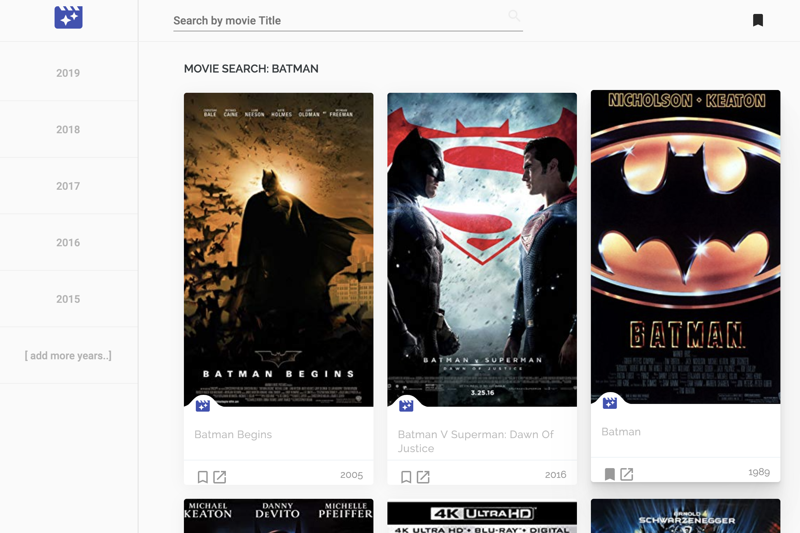

# OMDB search

This project was generated with [Angular CLI](https://github.com/angular/angular-cli) version 7.1.4.

This is a DESKTOP APP, hence not supporting mobile layout at the moment. 

## Search

To search for a movie by title, start typing the name of the movie.  

## Save

You can save a movie to your favorite list by clicking the bookmark icon on each movie

## View on IMDB

Click the "open" icon to view the movie on IMDB

## View saved

Click the Bookmark icon on the top right corner to view your saved list

## filter by year

Because of API limit, we do not allow year lookup only. Once typing a movie title to search for, you can select the year of the movie (for the demo we show few years back).

## TODO
- Mobile / Responsive design
- Add editor's pick
- Add different sources of movie databases
- Add categories    
